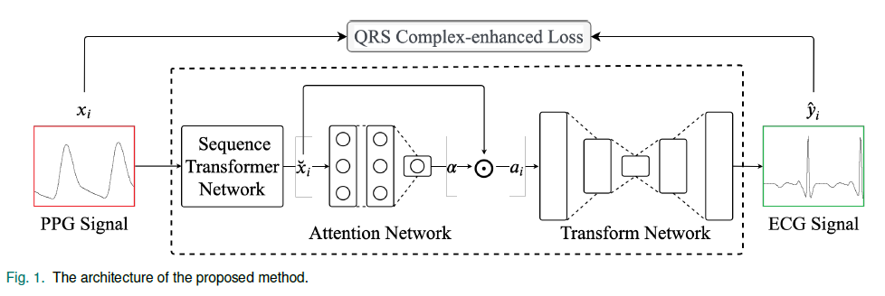
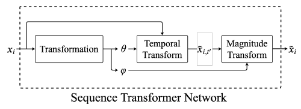

### Abstract

PPG에서 ECG의 QRS 복합체를 직접적으로 디코딩하는 과정은 Challenging한 일이다.

이유는 2가지

* different Devices
* Personal Differences
  * alignment를 어렵게 만든다.

저자는 3가지 요소를 포함하는 새로운 encoder-decoder Architecture를 제안한다.

1. 오프셋을 자동적으로 보정해주는 sequence Transformer Network
2. 동적으로 ROI를 식별하는 Attention Network
3. 더 나은 재구성을 위한 강화된 QRS Complex Loss

그 결과 재구성된 ECG의 R Peak Failure Rate는 3.67% , 기존 GT의 QRS complex 맥박 전달 시간과 재구성된 QRS Complex의 맥박 전달 시간의 높은 상관관계(p = 0.844)를 갖는다.

이를 통해 저비용 임상 연구의 새로운 기회를 만들 수 있다.

### Introduction

세계 인구 증가와 고령화가 증가함에 따라, 심전도 신호의 지속적인 모니터링 개인의료를 위해 중요해짐

ECG는 전극을 피부에 붙이는 것을 이용함으로써 심장의 전기적 신호를 반영하는 P,Q,R,S,T Peak를 포함하고 있고, 심혈관 병리학에 필수적인 정보를 제공한다.

근데 ECG는 측정하는데 좀 불편하다, 왜냐면 표준 12개의 신호 유도 장비를 피부 위 서로 다른 위치에 놓아야 한다.

--> 기록 중에 불편함을 느낄 수 있음

반면에, PPG는 조직의 미세혈관층에서의 혈액량 변화를 탐지가능한 신호를 광학적으로 획득된다.

PPG 파형의 모양 특성, 규모, 길이는 혈액 산소 포화도, 심장 박동, 혈압, 심박 출량?, 호흡률로 변환할 수 있다.

PPG를 추출하는 과정이 비침습적, 설치하기 편리함, 저비용임

스마트폰, 스마트워치, 웨어러블 디바이스 --(소비자 단계)--> 지속성,장기간 모니터링을 제공함

근데 PPG는 비록 Healthcare 모니터링으로 유명하지만, ECG는 여전히 의학 진단에 있어 표준적, 필수적인 측정법 --> 풍부한 문헌자료, 연구가 있음. 그래서 의사들은 여전히 PPG 대신 ECG에 의존한다.

PPG interval  <상관관계 > ECG RR-interval  ----> 이것은 PPG 만을 가지고 ECG로 변환의 가능성을 나타냄

한가지 가능성은 RNN으로 PPG를 ECG로 바꾸는 것.

> RNN은 노이즈에 민감, 시간 종속성으로 compute됨

따라서 스마트 워치에 적합 X (Resource-limit device)

ECG를 변환하기 위한 transform Network로 CNN기반 encoder-decoder 구조를 채택하게됨

encoder-decorder 구조가 아래 task들은 성공적으로 됨이 입증되었다.

- Domain Adaption [9]
- Signal Denoising [10-12]
- Anomaly Detection [10]

> 위 논문들은 읽어볼 것 
>
> [9] M. Chen, Z. Xu, K. Q. Weinberger, and F. Sha, “Marginalized denoising autoencoders for domain adaptation,” in International Conference on Machine Learning (ICML), Jun 2012.
>
> [10] M. Sakurada and T. Yairi, “Anomaly detection using autoencoders with nonlinear dimensionality reduction,” in Workshop on Machine Learning for Sensory Data Analysis (MLSDA), Dec 2014.
>
> [11] G. Litjens, T. Kooi, B. E. Bejnordi, A. A. A. Setio, F. Ciompi, M. Ghafoorian, J. A. van der Laak, B. van Ginneken, and C. I. S´anchez, “A survey on deep learning in medical image analysis,” Medical Image Analysis, vol. 42, p. 60–88, Dec 2017. 
>
> [12] S. M. Erfani, S. Rajasegarar, S. Karunasekera, and C. Leckie, “Highdimensional and large-scale anomaly detection using a linear one-class svm with deep learning,” Pattern Recognition, vol. 58, pp. 121–134, Oct 2016.

### Related Work

PPG to ECG 변환 논문들

1. 머신러닝 기반 Feature 선택 방식
   PPG Feautre를 사용해서 ECG 매개변수의 범위를 추정함

   Maximal Information Coefficient를 기반으로 하는 시그모이드 함수 사용 --> 더 높은 정확도

   노이즈가 많은 PPG 데이터에 대한 성능을 개선하기 위해 이상치 데이터 제거

>  [18] R. Banerjee, A. Sinha, A. D. Choudhury, and A. Visvanathan, “Photoecg: Photoplethysmographyto estimate ecg parameters,” in IEEE International Conference on Acoustics, Speech and Signal Processing (ICASSP), May 2014

2. PPG 주기의 DCT 변환계수를 ECG  주기의 계수로 맵핑하여 ECG 파형을 재구성할 수 있는 방법 제안

   전처리 단계에서 PTT, HRV와 같은 Temporal Information 을 잃게되기 때문에 좋은 방법이 아님, 또한 전처리 오버헤드는 실시간 변환이 어려움

> [19] Q. Zhu, X. Tian, C.-W. Wong, and M. Wu, “Learning your heart actions from pulse: Ecg waveform reconstruction from ppg,” bioRxiv, Oct 2019.

### Proposed Algorithm

#### A. Database Description

* UQVSD Dataset (for Transfrom Learning)

  * PPG, ECG로 페어링된 데이터 --> transform Learning을 위해서
  * 55시간 동안 마취를 받은 32명의 수술 환자로 부터 얻은 것 --> 주로 정상심박수

  * 앞단,끝단에서 발생할 수 있는 사람에서 발생한 error, instrumental? noisy data를 필터링하고 신호 길이 균형을 유지함

또 다른 데이터는 일반화 가능성을 평가하기 위해서 사용

* BIDMC Dataset

  * PPG, Respiration Dataset
  * paired PPG, ECG
  * 중환자 53명의 데이터 (8분)

  * PPG, ECG 파형이 UQVSD 데이터셋과 상당히 다름
    * 더 nosiy하고 abnormal함

따라서 UQVSD를 평가데이터셋을 메인으로 쓰고, BIDMC는 robust, generalizability를 검증하기 위해 사용함

#### B. Proposed Method

PPG : $x_i=(x_i,_1,\cdots,x_i,_t,\cdots,x_i,_{T_i})$  

ECG : $y_i=(y_i,_1,\cdots,y_i,_t,\cdots,y_i,_{T_i})$

* $i$ 는 User를 의미하고, $T_i$ 는 total number of time steps
* $x_i,_t$ $y_i,_t$ 는 각각 PPG와 ECG의 user $i$의 시간 $t$를 의미한다.

동시에 측정된 N명의 사용자 PPG($x$),ECG($y$) Dataset $D$ 는 다음과 같이 쓸 수 있다

* $D = \{(x_i,y_i)|1\leq i \leq N\}$ 

$x_i$를 $y_i$에 근접한 $\widehat{y_i}$로 변환하는 것을 목표로 함

* 제안된 모델의 Flow Chart
  

  #### 								Input PPG --(encoding)--> Latent Feature --(decoding)--> reconstruct ECG

이러한 encoder-decoder 구조는 차수 감소 프로세스로 여겨질 수 있고, Noise에 더 Robust해진다.

encoder-decoder에는 RNN 대신에 1차원 CNN을 사용함

* 다만 CNN은 입력 크기와 위상에 민감하게 반응함

이를 해결하고자 STN (Sequence Transformer Network) 을 제시함

* 제안된 STN
  

STN은 학습가능한 $\theta$ 와 $\phi$ 를 사용하여 각각 Input의 phase(위상), magnitude(크기) 를 변환한다.

$\theta$를 사용해서 STN은 <u>temporal Transformation</u> 을 학습한다.

> temporal transformation 이 무슨 뜻인지..?

그리고 이 temporal transformation은 기존의 input인 $x_i,_t$를 변형시키고, output인 새로운 temporal location 에 맵핑시킨다. 식은 다음과 같다.
$$
t^\prime = \theta \begin{bmatrix} t \\ 1 \end{bmatrix} = \begin{bmatrix} \theta_1 & \theta_0 \end{bmatrix} \begin{bmatrix} t \\ 1 \end{bmatrix}
$$
original time point $t$   --($\theta_0$ , $\theta_1$)--> $t^\prime$  ==> $\tilde{x}_i,_{t^\prime} = x_i,_{({\theta}_it+\theta_0)}$ 이와 같이 변환한다.

$t^\prime = \theta_1t +\theta_0$ 는 양수(index)를 보장하지 않는다, 저자들은 변환된 점들로 부터 인접한 두개의 점의 평균을 사용하여 index 값을 추출하려고 **Linear Sampling**을 사용하였다.

>ex)
>
>$t^\prime$이 1.5 이라면, $\tilde{x}_i,_{t^\prime}$ 는 $x_i,_1$ 과 $x_i,_2$의 평균을 취한 값으로 계산된다.

temporal transformation 후에, 일시적으로 변환된 신호인 $\tilde{x}_i$ 값을 추출하고 더 나아가 크기변환 $\phi$ 를 사용하여 크기를 조정한다. 
$$
\breve{x}_i,_t = \phi \begin{bmatrix} \tilde{x}_i,_{t} \\ 1 \end{bmatrix} = \begin{bmatrix} \phi_1 & \phi_0 \end{bmatrix} \begin{bmatrix} \tilde{x}_i,_{t} \\ 1 \end{bmatrix}
$$
 시간 $t$에 대한 $\tilde{x}_i,_{t}$ 의 크기$\phi_0$ 와 $\phi_1$로 $\breve{x}_i,_{t}$ 에 맵핑시켜 크기를 shift, scailing 시킬 수 있다.

>  $\breve{x}_i,_t = \phi_1 \tilde{x}_i,_t + \phi_0$ 

위 temporal and magnitude transformation은 STN을 위한 normalization으로 간주될 수 있음. 이 변환은 다른 사람 혹은 다른 센서로 부터 나온 결과의 offset으로 인해 성능이 상당히 향상될 수 있다.

> 입력이 다른사람 혹은 다른 센서 결과로부터 나온 offset으로 인해 성능이 크게 개선된다.p

$\breve{x}_i = STN(x_i)$  $\cdots$ $Attn()$

Attention Network는 ECG 재구성을 위한 input PPG 의 중요한 부분을 학습하는데 활용된다.

2개의 FCN layer, 활성화 함수는 softmax 을 사용하였다.

> softmax는 입력을 가져와서 확률분포로 정규화 한다.

$\breve{x}_i$ 는 우선 attention weight vector ($\alpha$) 를 생성하기 위해 attention Network에 입력으로 주어진다.

> $\alpha$ 는 $\breve{x}_i$ 와 같은 차원이다.

그 후, $\alpha$는 input Size $T$ 에 의해 증폭되는데, 그 이유는 기존 $\alpha$가 softmax 함수를 통과하기 위해서다.

> 근데 이건 gradient Vanishing 문제를 야기할 수 있다.

최종적으로 기존의 input과 곱해서 attened Signal 이라는 $a_i$를 생성해낸다. 다음 수식과 같다.
$$
a_i = T \times Attn(\breve{x}_i)\odot\breve{x}_i
$$
$Encoder() , Decoder()$ 함수는 $a_i$ 를 변환 시키기 위해 각각 사용되고 이 두개를 일컫어서 **transform Network**라고 칭한다. 

[24]에서 생성된 네트워크의 얕은 버전을 사용했다고 함

> [24]  Pascual, Santiago, Bonafonte, Antonio, and J. Serra, “Segan: Speech ` enhancement generative adversarial network,” in Annual Conference of the International Speech Communication Association (INTERSPEECH), Aug 2017.
>
> speech denoising에 강력한 네트워크

구체적으로 [24]와 비슷하게 kernel size 31, 10개의 레이어 (sampling rate가 더 작기 때문, 그래서 인풋 사이즈도 200으로 줄여짐)

encoding Stage에서 입력신호는 여러 Strided Convolutional Layer를 통해서 projection되고 압축된다.

제안한 transform network는 strided convolutions를 사용하여 오직 2번, 기존 사이즈 200 에서 50으로 해상도를 감소시킨다.

> 이는 [25] 에서 증명되었다.
>
> [25] S. Iizuka, E. Simo-Serra, and H. Ishikawa, “Globally and locally consistent image completion,” in Special Interest Group on Computer Graphics and Interactive Techniques (SIGGRAPH), Jul 2017

Decoding Stage 에서는 strided transposed Convolution (by PReLUs)을 사용한 encoding network의 역버전이다.
$$
\hat{y}_i = Decoder(Encoder(a_i)).
$$
<u>제안된 방법의 중요한 feature 중 하나는 재구성을 완성하기위한 복잡한 신호처리, 그리고 수작업으로 작업한 하이퍼파라미터가 필요하지 않는 raw input signals를 처리하는 기능을 가진 end-to-end training이라는 것이다.</u>

Loss Function으로 $L_1$ norm을 선택였는데, 이는 reconstructed ECG , groundtruth ECG와의 거리를 최소화하기위해 사용했다. $L_2$ Norm 보다 급격히 변화하는 신호를 생성하는 것에 대해 효과적이다.
$$
L_1 = \sum_{i\in N}{|y_i-\hat{y}_i|}
$$

> 오차 절대값의 합

#### C. QRS Complex-Enhanced Loss( hyper parameter : $\sigma$ )

위 $L_1$의 식은 QRS Complex의 중요성을 강조하지 않고, 재구성된 ECG의 R peak 크기가 실제 값보다 더 작아지게 되는 경향이 있어서

이는 ECG내의 R Peak가 누락된다.

그 이유는 $L_1$ loss는 R peak의 위치가 조금만 어긋나있어도 손실이 크게 증가하기 때문에 이러한 큰 에러를 발생하는 타입을 피하기 위해 magnitude(크기)를 더 작게 만든다. --> 그래서 R Peak가 누락된다.

그래서 이 논문에서는 QRS complex-enhanced Loss , $L_{QRS}$ 를 고안했는데, 이 $L_{QRS}$는 전체 신경망이 <u>R Peak index를 평균으로, 하이퍼파라미터인 $\sigma$ 를 분산으로 사용하는 비정규화 가우시안 함수에 의해</u> QRS complex Area에 집중하도록 권장하는 손실함수다.

$c_i = (c_i,_1,\cdots,c_i,_k,\cdots,c_i,_{K_i})$ 는 $y_i$에 대한 R peak index를 나타내고, $K_i$는 R Peak의 개수를 나타낸다.
$$
L_{QRS} = \sum_{i=1}^N \sum_{t=1}^{T}{|y_i,_t - \hat{y}_i,_t|}{(1+\beta\sum_{k=1}^{K_i}e^-\frac{(t-c_i,_k)^2}{2\sigma^2})}
$$
여기서 $\beta$는 가우시안 가중치 함수의 영향을 제어하는 hyper-parameter 이다.

 output $\hat{y}_i$ 가 R Peak 영역내에 있는 groundtruth $y_i$를 정확하게 재구성하지 못하는 경우, QRS-complex enhanced Loss는 커진다.

training을 위한 R Peak labeling은 state-of-the-art method (the Hamilton Segmenter)를 사용하였다. [27]

>[27] P. Hamilton, “Open source ecg analysis,” in IEEE Conference on Computers in Cardiology (CinC), Sep 2002.

이 방식은 BioSPPy라고 불리는 생체신호처리를 위한 public toolbox이고 이런 The Hamilton Segmenter는 MIT/BIT와 AHA Dataset에서 93%의 QRS complex 민감도를 탐지하기위한 강력한 분류기로 입증되었고 이것은 ECG 내의 R peak Detection에 있어 높은 performance를 보여준다.

### Result

#### Experiment Setup

min-max Scalar Normalization 으로 [-1, 1] 크기로 Transform

2개의 bandpass filter를 노이즈를 제거하기위해 ECG, PPG 에 적용시켰음

Train-HyperParameter

* epoch : 300
* Optimizer : Adam
* learning Rate : 0.0001
* Batch Size : 256

Data Augmentation을 PPG의 모든 위치로부터 변환을 시작하는 것을 효과적으로 학습하기 위해 사용하였음

* input PPG의 Phase를 랜덤으로 Shift 시키고 ECG의 Ground-Truth를 [-10,10] 내에서 모델을 훈련시키기 위해 제공함
* Data Augmentation은 R Peak가 boundary에 있을 때 Conv layer의 Boundary Issue를 완화시킨다.

10-ford-cross-validation 사용하고 결과들의 평균값을 계산하였음

#### Evaluation Metrics

사용하는 metrics 는 총 7개이다

* $L1_{QRS}$ (loss of QRS Complex area)
* $L1_{nQRS}$ (loss of non-QRS complex area)

* NMAE (Normalized Mean Absoulte Error)

  * $$
    NMAE = \frac{\sum_{i\in N}|y_i-\hat{y}_i|}{\sum_{i\in N}|\hat{y}_i|}
    $$

* 

* NRMSE (Normalized Root Mean Square Error)

  * $$
    NRMSE = \frac{\frac{\sum_{i\in N}|y_i-\hat{y}_i|}{N}}{max_{i\in N} \\\ y_i - min_{i\in N} \\\ y_i}
    $$

NMAE, NRMSE 는 outlier에 저항하므로 이것은 전체 성능으로 보여질 수 있다.

QRS Complex areas 식별할 때, 이전 연구[30]에 따르면 **<u>normal intrinsicoid deflection (Q-R interval)</u>** 는 최대 50ms, QRS 진폭(duration) 은 최대 120ms 가 걸린다.

그래서 저자들은 R Peak index에서 -50ms ~ +70ms 이 범위를 QRS complex area라고 지정하고 남는 부분을 non-QRS Complex area 라고 지정했다.

게다가 3가지 metrics를 더 쓰는데, MLE , MME , $R_{FAIL}$ 를 더 쓴다.

$D_{test}$ 는 test 데이터를 나타내고, $\hat{c}_i,_k$ 는 $c_i,_k$ 와 가까운 $\hat{y}_i$ 의 R peak position을 의미한다.

> 여기서 $c_i,_k$ 는  i = R Peak index, k =  R Peak 개수를 나타낸다.

* MLE (Mean Location Error)

  * $$
    MLE = \frac{1}{|D_{test}|} \frac{1}{K_i} \sum_{(x_i,y_i) \in D_{test}} \sum_{k=1}^{K_i} f(c_i,_k , \hat{c}_i,_k) \\
    \\
    f(c_i,_k,\hat{c}_i,_k) = \begin{Bmatrix}|c_i,_k - \hat{c}_i,_k\ \;\; if\;|c_i,_k - \hat{c}_i,_k|<10 \\ 10 \;\;\;\;\;\;\;\;\;\;otherwise\end{Bmatrix}
    $$

R Peak들의 Mean Location Error (MLE) 는 GroundTruth ECG와 재구성된 ECG사이의 r peak position의 차이를 측정한 

* MME (Mean Magnitude Error)

  * $$
    MME = \frac{1}{|D_{test}|} \frac{1}{K_i} \sum_{(x_i,y_i) \in D_{test}} \sum_{k=1}^{K_i} |y_i,_{c_i,_k} - \hat{y}_i,_{c_i,_k}|
    $$
    
    
  

R Peak들의 MME(Mean Magnitude Error) 는 groundtruth ECG와 재구성된 ECG 사이에 R Peak의 크기들의 차이를 측정하기 위해 제안된 metrics 다

위 두개의 Metrics는 심장 박동 세그먼트, 혹은 ECG의 다른 형태학적 파라미터를 검출하는데 필요한 R peak 들의 품질(퀄리티)를 반영한다. [27]

> [27] P. Hamilton, “Open source ecg analysis,” in IEEE Conference on Computers in Cardiology (CinC), Sep 2002.

MLE는 R peak가 정확히 위치하는지, MME는 재구성된 R Peak의 크기의 오차를 나타낸다. 게다가 MLE, MME 의 분산은 재구성된 ECG의 안정성을 보여주기위해 계산된다.

* $R_{FAIL}$ rate

  * $$
    R_{FAIL} = \frac{\text{failed R peak detection}}{\text{all R peaks in groundtruth signals}}
    $$

저자들은  groundtruth ECG와 재구성된 ECG 모두에 대한 R Peak 검출 알고리즘을 수행했고 시스템의 적합성과 QRS complex의 퀄리티를 계산하기 위해 R peak Failure Rate ($R_{FAIL}$) 를 계산하였다.

<u>groundtruth R Peak의 index에서 -75ms ~ 75ms 사이에 재구성된 신호내에 탐지된 R Peak 가 없다면 failed R Peak detection으로 간주한다.</u>

> [31]  C. Meyer, J. F. Gavela, and M. Harris, “Combining algorithms in automatic detection of qrs complexes in ecg signals,” IEEE Transactions on Information Technology in Biomedicine, vol. 10, pp. 468–475, Jul 2006.

#### C. Quantitative Results

[32] 에서 사용한 Vanilla LSTM (LSTM-based transform Network) 과 성능 비교한 표 이다.

 /%EA%B8%B0%EA%B3%84%ED%95%99%EC%8A%B5/%EB%85%BC%EB%AC%B8/figure/ppg2ecg/image-20211119181909893.png)

> [32] G. K. Anumanchipalli, J. Chartier, and E. F. Chang, “Speech synthesis from neural decoding of spoken sentences,” Nature, vol. 568, pp. 493– 498, Apr 2019.

모든 Metrics에서 Vanilla LSTM을 능가한다.

CNN이 시간적 패턴들을 잘 포착하는 반면에 ECG 신호를 더 정확하게 재구성하기위해 Sequence Transformer Network와 Attention Network는 main Transform Network를 도와준다

추가적으로 non-QRS complex area는 QRS complex 구역에서 가지는 loss 보다 더 적은 $L_1$ loss 를 가지고 있는데, 이는 QRS Complex의 파형이 일정한 flatline을 갖고있는 non-QRS complex area 보다 더 복잡하기 때문이다. (어찌보면 당연한 이야기)

MLE (Mean Location Error)는 1.611 인데, 이는 샘플링속도 100hz에서 R peak index의 평균 16.11ms정도의 에러라고 해석할 수 있다.

그리고 Vanilla LSTM에 의해 생성된 ECG R peak의 진폭크기는 더 작은데, 이는 R Peak를 찾는데 큰 실패율을 초래한다.

제안된 모델은 Groundtruth ECG에서 3890개의 R Peak를 성공적으로 찾았고  평균적으로 142개의 R Peak가 누락된다. 그래서 $R_{FAIL} = 3.67\%$ 가 나온다.

 --> 향상될 수 있었던 이유는 QRS complex를 좋은 퀄리티로 생성해냈기 때문
/%EA%B8%B0%EA%B3%84%ED%95%99%EC%8A%B5/%EB%85%BC%EB%AC%B8/figure/ppg2ecg/image-20211123184432871.png)

Vanilla LSTM에 비해 Batch Size가 클수록 훨씬 효율성(속도)가 좋은데, 이는 여러 위치에서 동일한 필터의 Conv를 병렬로 계산할 수 있기 때문에 좋다.

LSTM은 순차적으로 처리해야함 --> 이전 단계에 따라 후속 단계가 달라짐

제안된 모델의 일반화 가능성을 보여주기위해 BIDMC dataset을 똑같은 하이퍼 파라미터를 사용하였다.

BIDMC는 sampling rate가 125Hz 이므로 input size 256을 사용함 (기존은 200이었음), 또한 기록된 ECG 길이가 UQVSD의 26% 밖에 안됨 --> 더 작은 데이터로 학습시킨다는 뜻
/%EA%B8%B0%EA%B3%84%ED%95%99%EC%8A%B5/%EB%85%BC%EB%AC%B8/figure/ppg2ecg/image-20211123185210465.png)

MLE, MME가 낮을 수록 R Peak 실패율이 높은 이유는 BIDMC 데이터셋에서 심각한 환자의 노이즈가 많은 데이터 때문일 것으로 예상함

--> 저자가 제안한 모델은 정상파형뿐만 아니라 노이즈 섞인 비정상적인 신호에도 잘 수행됨을 보여준다.

#### D. Qualitative Results

/%EA%B8%B0%EA%B3%84%ED%95%99%EC%8A%B5/%EB%85%BC%EB%AC%B8/figure/ppg2ecg/image-20211123190832682.png)

Fig. 3. 은 8초 정도의 PPG 신호를 ECG 신호로 재구성한 결과 사진이다.

(a) proposed Model
/%EA%B8%B0%EA%B3%84%ED%95%99%EC%8A%B5/%EB%85%BC%EB%AC%B8/figure/ppg2ecg/image-20211123204638515.png)

* R peak로 정렬된 GroundTruth, Reconstructed ECG들 bottom-right
* 가장 최고의 모델

(b) proposed Model without QRS Complex-enhanced Loss
/%EA%B8%B0%EA%B3%84%ED%95%99%EC%8A%B5/%EB%85%BC%EB%AC%B8/figure/ppg2ecg/image-20211123205417081.png)

* (a) 보다 조금 더 큰 손실

(c) Vanilla CNN
/%EA%B8%B0%EA%B3%84%ED%95%99%EC%8A%B5/%EB%85%BC%EB%AC%B8/figure/ppg2ecg/image-20211123205604445.png)

* 전체적인 평가가 (a) 보다 별로임

(d) Vanilla LSTM
/%EA%B8%B0%EA%B3%84%ED%95%99%EC%8A%B5/%EB%85%BC%EB%AC%B8/figure/ppg2ecg/image-20211123205627776.png)

* R Peak의 값이 실제 값과 작기 때문에, 성능이 가장 안좋음

> 가장 좋은 성능은 **Magnitude(크기)가 같고** 위치가 같은 것

다른 모델도 위치는 잘 찾는데, 크기는 잘 못 맞추지만, 제안된 모델은 잘 맞춤

#### E. Sensitivity Analysis and Ablation Study

/%EA%B8%B0%EA%B3%84%ED%95%99%EC%8A%B5/%EB%85%BC%EB%AC%B8/figure/ppg2ecg/image-20211123211044258.png)

* 위 표 5는 UQVSD의 하이퍼 파라미터 $\sigma$ 분산에 따른 MLE,MME, $R_{FAIL}$ 수치 변화를 나타냄

* $\sigma$ 가 1 일때 MLE,MME , $R_{FAIL}$ 모두 다 좋은 성능을 보임

/%EA%B8%B0%EA%B3%84%ED%95%99%EC%8A%B5/%EB%85%BC%EB%AC%B8/figure/ppg2ecg/image-20211123212536053.png)

* $\beta$ : 가우시안 가중치 함수의 영향을 제어하는 hyper-parameter 이다.
* 0.5일때 MLE, MME, $R_{FAIL}$ 이 가장 좋은 성능을 낸다.

* <u>0 일때에는 QRS Complex Loss에 불이익을 주는데 사용되며, Beta = 0 은 L1 손실, R Peak failure 에서는 최악의 성능을 보인다</u>

따라서 최고의 성능을 내는 하이퍼 파라미ㄴ터는 각각 $\sigma = 1 ,\,\, \beta = 0.5$  일 때 성능이 가장 좋다.

/%EA%B8%B0%EA%B3%84%ED%95%99%EC%8A%B5/%EB%85%BC%EB%AC%B8/figure/ppg2ecg/image-20211124174753910.png)

> STN은 Sequence Transformer Network를 의미한다.

여기서 transformer Network를 비활성화 하면, MLE, MLE 분산, MME 분산이 증가하여 $R_{FAIL}$ 가 증가한다.

Attention Network는 R peak의 위치가 더 중요함 --> Vanilla Model(기본 모델)에 비해 MLE, MME 모두 도움 됨

Attention은 <u>심전도를 재구성할 중요한 샘플을 선택하는 transformer Network</u> 기능에 추가함

$L_{QRS}$는 낮은 MME를 얻도록 도와줌 즉 R Peak Magnitude 에 필수적인 역할을 함

모듈 전체를 섞는 것은 낮은 MLE, MME 를 얻는데 필요함

STN과 Attention Network는 정확한 reconstruct R peak의 Location을 찾는데, $L_{QRS}$ 는 R Peak 크기에 크리티컬한 영향을 줌

/%EA%B8%B0%EA%B3%84%ED%95%99%EC%8A%B5/%EB%85%BC%EB%AC%B8/figure/ppg2ecg/image-20211125210002965.png)

Data Augmentation은 R Peak Location에 큰 영향을 주었음 TABLE VIII를 보았을 때 DA가 있을때 1.611, 없을때 1.828 의 MLE를 갖는다.

<u>DA는 R Peak가 있는 이동된 sample에서 학습할 수 있는 기회를 제공함</u>

따라서 DA는 training을 안정화시키는데, 중요한 역할을 함

/%EA%B8%B0%EA%B3%84%ED%95%99%EC%8A%B5/%EB%85%BC%EB%AC%B8/figure/ppg2ecg/image-20211125210801400.png)
$L_{QRS}$ 를 기본적인 LSTM에 적용시켰을 때에는도 성능이 크게 향상되었음을 TABLE IX를 보고 알 수 있다.

이로써 $L_{QRS}$의 **generalizability** (일반화 가능성)가 입증되었다.

#### F. Possible  Application

이 장은 제안된 모델이 응용분야에 사용가능한지에 대한 설명이다.

이 모델의 장점은 다음과 같다.

1. ECG, PPG를 동시에 측정하지 않아도 PPG 에서 ECG로 직접 변환에 대한 가능성
2. ECG, PPG 사이의 시간적 정보를 보존함
   /%EA%B8%B0%EA%B3%84%ED%95%99%EC%8A%B5/%EB%85%BC%EB%AC%B8/figure/ppg2ecg/image-20211125212713762.png)
   * UQVSD 데이터셋에서의 GT의 신호와 재구성된 신호의 **PTT(Pulse Transit Time, 신호 전달 시간)**
   * 위 Fig를 보았을 때, 기존 GroundTruth의 PTT와 재구성된 ECG의 PTT시간의 차이는 10ms 다.
   * 제안된 모델은 PPG와 재구성된 ECG에서 Peak의 시간 차이를 측정하여 PTT를 검색하는 기능을 가지고 있음

> Pulse Transit Time : 맥파전달시간, 동맥을 따라서 맥파가 한 지점에서 다른 지점으로 전달될 때 소요되는 시간
>
> <u>박동성 압력파가 대동맥 판막으로부터 말초부위까지 전달되는 시간</u>
>
> 이런 PTT는 Blood Pressure Estimation, Respiratory Effort, Heart rate 그 외 등등 생체신호 .. 에 매우 중요한 역할을 함
>
> PTT에 대해서는 좀 더 공부해야할듯

<u>Sliding Window를 사용해서 데이터가 Serialized 되므로, 다음 TC에 대해서 발생할 수 있는 R Peak에 대해 두 개의 연속적인 TC를 고려하여 PTT를 계산</u> --> 뜻 해석하기 어려움

ECG R Peak ----- PPG Peak의 시간이 ECG 의 RR interval의 80%임을 지적한 선행연구 [37] 가 있었기에 480ms ~ 800ms 범위 내의 PTT 값을 필터링함

성인의 정상 안정시 심박수는 분당 60~100회 내에 있다. 따라서 5483개의 R Peak 중 323개의 실패한 PTT를 검출됨
/%EA%B8%B0%EA%B3%84%ED%95%99%EC%8A%B5/%EB%85%BC%EB%AC%B8/figure/ppg2ecg/image-20211126143957847.png)

Pearson 상관계수를 사용해서 GT와 RS(reconstruct) PTT를 평가하였는데, 결과는 대부분의 PTT가 550ms~750ms에서 소실되었음을 보인다.

이는 상관계수 0.844일때 소실되었음을 보인다

> [37] A. Vest, Q. Li, C. Liu, S. Nemati, G. Da Poian, A. Shah, and G. Clifford, “An open source benchmarked toolbox for cardiovascular waveform and interval analysis,” Physiological Measurement, vol. 39, p. 105004, Oct 2018.

<u>The results indicate that most of the PPT fell between 550ms and 750ms, while the correlation coefficient Q was equal to 0.844, which indicates that the PPT from the reconstructed ECG is similar to the groundtruth</u>

### Conclusion & Future Work

* PPG는 경제적, 쉬운 접근 

* ECG는 기초가 잘 연구되어있다.

위 두개의 장점을 활용하여 PPG -> ECG 로 변환하는 프레임워크를 제안했다.

제안된 모델은 Sequence Transformer Network와 Attention Network를 사용하였다.

> Attention Network는 오직 PPG로부터 받는 데이터를 ECG로 정확하게 재구성할 수 있게 main Transform Network를 도와주는 Network 다.

또한 QRS Complex-enhanced Loss는 모델을 더욱 robust하게 만든다.

2가지 데이터셋 (UQVSD & BIDMC) 으로 실험한 결과로 제안한 딥러닝 접근법의 효과와 일반화 가능성을 확인했다. 그리고 실시간 추론의 가능성도 확인했다.

추가적으로, 각 모듈 (Transformer Attention...)의 중요성을 보여줌 --> QRS 복합체에 대해 더 좋은 퀄리티를 탐색할 수 있는 방향성을 제시함

> Conclusion

이 연구는 다른 접근하기 쉬운 생체 신호로부터 생체 신호로 재구성하는 것을 위한 실행가능하고 잠재력이 있는 딥러닝 접근법이 될 수 있음을 말한다.

> Future Work

향후에는, 훈련을 위한 PPG,ECG 데이터의 개인 쌍이 필요한 것에 대해서 새로운 모델 아키텍쳐와 Few-shot 학습 기술을 이용해서 개선할 것이다.

